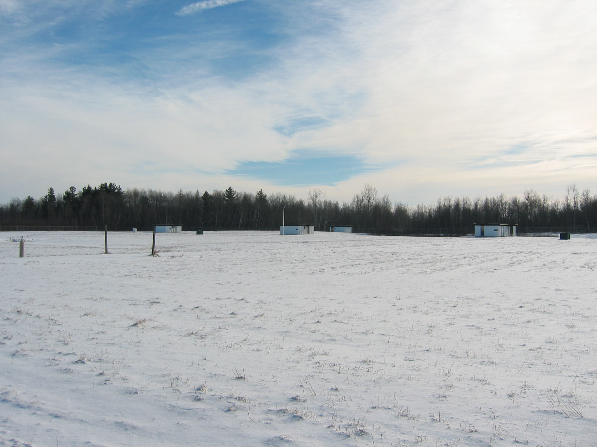
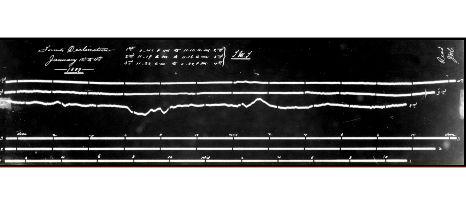
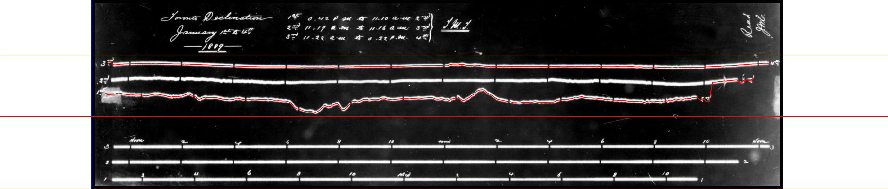
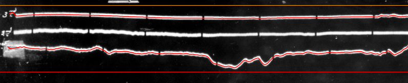
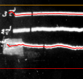
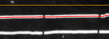
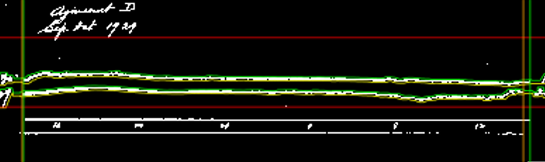
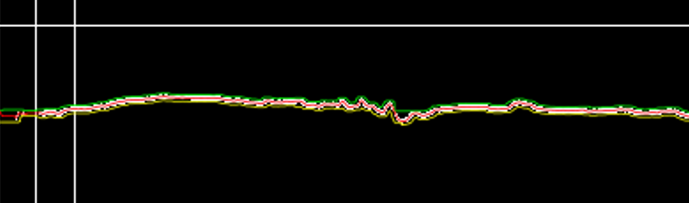
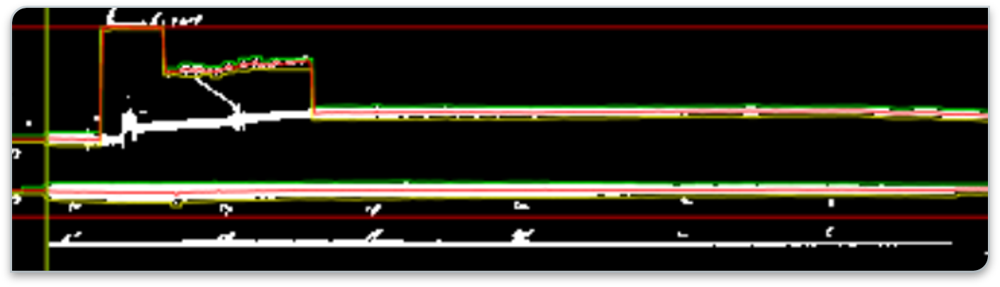

class: inverse

```{r include=FALSE}
library(ggplot2)
filter <- dplyr::filter
knitr::opts_chunk$set(warning=FALSE, message=FALSE, fig.width=10.5, fig.height=4, 
  comment=NA, rows.print=16)
theme_set(theme_gray(base_size = 24))
```

## A Brief History

* magnetic fields are generated by moving electric particles
* the Earth has a magnetic field
* this field varies across the surface and sub-surface and atmosphere of
the Earth
* observations of the magnetic field are useful for all sorts of 
physical science applications

---

class: inverse

## In Canada

* original magnetic observatory was in Toronto, founded in 1840
* the electrification of the Toronto tramway system resulted in interference,
and the observatory was moved to Agincourt in 1897
* the Agincourt Observatory was in continuous operation from 1898 to 1969,
but had to be closed due to industrial development and highway construction
* the Ottawa observatory (south of Ottawa, near Mer Bleue) was opened in July 1968, and has been in continuous operation since
* ... may need to be moved soon, as the O-Train extension is starting to inch closer and closer!

---

## The Observatory

<center>

</center>


---

class: inverse

## What Kind of Data is this?

Time series!

- The fluxgate magnetometer samples the magnetic field at 8 Hz
- Three component data streams
- Filtered, resampled at 1 Hz
- Further filtered and resampled at 0.2 Hz (5 seconds)
- Finally, filtered and resampled to 1 minute intervals

The four 1-minute data streams are passed to the transmitter to be relayed in bursts at 12 minute intervals via a GOES satellite to various data nodes.

---

class: inverse

## Project Progression and Contributors

Dr. David Boteler, head of the National Resources Canada Geomagnetic Observatory staff, contacted Dr. David Thomson and team at Queen's University to see if they could help digitize the original records from the previous iterations, before digitized records began in the 1970s.

---

## An Example of One Sample

<center>

</center>

---

class: inverse

## Project Progression and Contributors

* Dr. Aaron Springford, David Riegert: original proof of concept code, designed normalization algorithm
* (unnamed) summer students at Queen's: manual work of scanning the 35mm microfilm records
* Mark Weygang (MSc AMOD, Trent): extended algorithm, digitized 1/2 the corpus
* Ben Ott (summer research, Trent): refined codebase, finished extension of algorithm, designed Shiny front-end

---


## What Does a Magnetic Field Observation Look Like?

<center>

</center>

---

class: inverse

## How Did We Do This?

* start by flipping the colours and de-compressing the image
    - since the data was observed via an optical lens, there's an Airy disc-like scattering effect
    - use a Gaussian filter model for the scattering, inverse function
    - normalize the data range in the image to prevent oversaturation

---

class: inverse

## How Did We Do This?

* unsupervised learning (initially developed by Mark Weygang)
    - scan the image for a "top line"
    - scan the image for a "bottom line"
    - attempt to insert a line between the two signals
    - use a dynamic step scan, point-to-point, to try to trace out the signals, one at a time
    - attempt to determine start and end
* produces the red fit lines of the next image

---

class: inverse

## Unsupervised Fitting


<center>
 
<br />
 
 
</center>

---

class: inverse

## Issues

* not all images are so nicely behaved
    - lines can cross, or jump off page
    - detecting the start and end is tricky
    - no way of knowing if the unsupervised fit is "correct"
* there's a lot of images ...
    - if something breaks, how do we know what it was?
    - code quality ...
    
---

class: inverse

## Supervised Learning

* follow up with a human eyeball (Mark I)
* are the fits accurate through the center?
* are the fits starting at the correct column / pixel?
* are the fits ending at the correct column / pixel?
* do any of the traces intersect / cross? does the algorithm track this?

---

class: inverse

## Some Examples (1)

<center>
 
</center>

Ben Ott developed a better envelope algorithm in summer 2020 (green lines),
which helps understand intersections and flag them. It also prevents a lot
of the "wandering" that previously happened.

---

class: inverse

## Some Examples (2)

<center>
 
</center>

Example of the center line unsupervised fit, using the envelopes as
guides.

---

class: inverse

## Some Examples (3)

<center>
 
</center>

Example of an issue where the envelope fit and therefore the trace
are both pulled up suddenly by the detection of text as signal.
(Each image has handwriting on it to note things like date, time,
special events, etc.).

---

class: inverse

## Some Notes

* this doesn't seem, on the surface, like that big of a problem
* turns out, it's actually really tricky (to the point that Oxford astrophysicists just threw up their hands and gave up, re: the Greenwich versions of the same sort of data)
* supervised can only take you so far ... at some point, you need a human in the loop

---

class: inverse

## Shiny

* built on top of R, using a reactive interface using JavaScript
* easy development of dynamically interactive web applets, running R on the back-end
* naturally suited to a project that already has been built to run on R

---

class: inverse

## Quick Demo

* can manually intervene for any of the following:
    - top trace envelopes (top/bottom)
    - second trace envelopes (top/bottom)
    - note that there actually 3 traces
    - start and end of any traces
    - upper and lower data range clips (to eliminate timing ticks, text)
* regenerate!

Intervening like this is good enough to fix 95% of the remaining issues.
The rest will require manual intervention all the way along, as they are things like 3 interlaced traces, with a poorly developed image, and text written overtop. A general-purpose algorithm can't handle that.

---

class: inverse

## Left To Do

* a thesis (MSc or part of a PhD) in the statistical detection of timing ticks, and errors in the time steps of a time series
* aggregating and time-stamping all of the observations obtained via the digitization
* interpolating missing or damaged areas / regions / times
* determining vertical scale factors

---

class: inverse

## Why Care?

* this is a really cool data set!
* very, very old - data back to the 1840s!
* magnetic fields are known to be tightly coupled with sunspots, and solar activity: this gives us a proxy for climate change data!
* calibration of other retrospective data sets for climate and space, e.g., tree rings, sunspots, solar F10.7 activity
* the challenge is also pretty cool ...


---

class: inverse

## Closing Remarks

* always interested in having people contribute to this, although currently there's no funding from NRCan
* several MSc theses left in some of the tricky bits putting it all together
* probably another MSc in the pure analysis of the resulting corpus of data
* could definitely be small aspects suitable for 4800H if you're interested ...
* stats is pretty broad!


---

layout: false
class: inverse, middle

<center>
<a href="http://www.trentu.ca/math/"></a> &emsp;&emsp;
<a href="https://creativecommons.org/licenses/by/4.0/"></a>
</center>

- Contact me: [Email](mailto:wesleyburr@trentu.ca) or [Twitter](https://twitter.com/wsburr)
- Slides created via the R package [xaringan](https://github.com/yihui/xaringan) by Yihui Xie

<br/>
